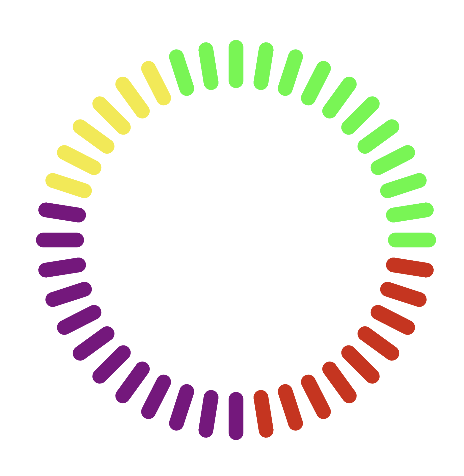

# MCircleBoard
> by Lynx

## 简介

MCircleBoard是一个iOS库，用于展示圆形仪表盘，用户可以随时调整仪表盘上的格子数，顺时针逆时针方向。

仪表盘的起始位置为最底部的格子，使用者可以使用默认的图片或者自己传入展示用的图片，使用者传入的图片必须为底部对应的图片（竖直方向的图标）。

## 使用

用户可以在创建MCircleBoard的实例的同时传入数据，也可以先创建实例并通过`setInterface`的方法更新。

传入的数据可以为数组或者元组数组（swift），用户可以自己传入图片数据也可以直接使用`MCircleItemType`下的默认图片，默认图片的创建及更新方法中数组的参数名为`defaultArray`。

*****

## Description

MCircleBoard is a iOS library that will display a circular dash board. You can modify the count of the items in the board and the rotation direction anytime.

The beginning point of the board is the bottom one. You can use default image or use your own image and the image you input must be the bottom item's(Vertical pattern icon).

## Usage

You can input data when create the  instance variable of MCircleBoard or update the data with `setInterface` after create the  instance variable of MCircleBoard.

The incoming data could be string array or tuple array(swift). You can input the image type array of MCircleItemType to use the default image or input the image name array to display the image you want. The parameter which is used in creating the  instance variable of MCircleBoard and refresh data is defaultArray.

