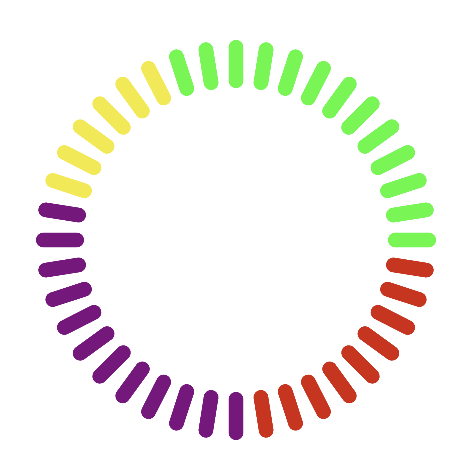

# MCircleBoard


## 简介

MCircleBoard是一个iOS库，用于展示环形刻度图，用户可以随时对环形刻度图进行调整，更改仪表盘位置、大小、格子数以及顺逆时针方向等。

环形刻度图的起始位置为最底部的格子，使用者可以使用默认的图片或者自己传入展示用的图片，使用者传入的图片必须为底部对应的图片（竖直方向的图标）。

图片样式如下：


## 使用

### Swift Package Manager

在 Xcode 中选择 `File > Add Package Dependencies...`，然后输入：

```
https://github.com/MichaelLynx/MCircleBoard.git
```


### CocoaPods

可以在 `Podfile` 中添加：

```
pod 'MCircleBoard'
```

### 手动集成

也可以直接下载 GitHub 上的项目，并将 `Code` 文件夹下的文件拖入自己的 Xcode 项目中使用。

用户可以在创建MCircleBoard类的时候填写参数，也可以在创建后使用`setupInterface`方法对MCircleBoard进行更新。

用户可以使用MCircleBoard内置的图片（`MCircleItemType`）进行布局，也可以自行传入图片进行布局。


*****


## Description

MCircleBoard is a iOS library that will display a circular scale chart. You can modify the board at any time , like the count of the items, the rotation direction and so on.

The beginning point of the board is the bottom one. You can use default image or use your own image and the image you input must be the bottom item's(Vertical pattern icon).

The pattern of the icon must be like this:


## Usage

### Swift Package Manager

In Xcode, select `File > Add Package Dependencies...` and enter:

```
https://github.com/MichaelLynx/MCircleBoard.git
```


### CocoaPods

To integrate MCircleBoard into your Xcode project using CocoaPods, specify it in your `Podfile`:

```
pod 'MCircleBoard'
```

You can also download MCircleBoard to your computer and drag the file `Code` into the Project Navigator of your application's Xcode project.

You can input parameters to the MCircleBoard when you initialize it or use `setupInterface` to update it.

The incoming data could be string array or tuple array(swift). You can input the image type array of `MCircleItemType` to use the default image or input the image name array to display the image you want. 



